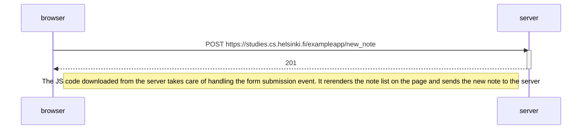

```mermaid

sequenceDiagram
    participant browser
    participant server

    browser->>server: POST https://studies.cs.helsinki.fi/exampleapp/new_note
    activate server
    server-->>browser: 201
    deactivate server

    Note right of browser: The JS code downloaded from the server takes care of handling the form submission event. It rerenders the note list on the page and sends the new note to the server
```
